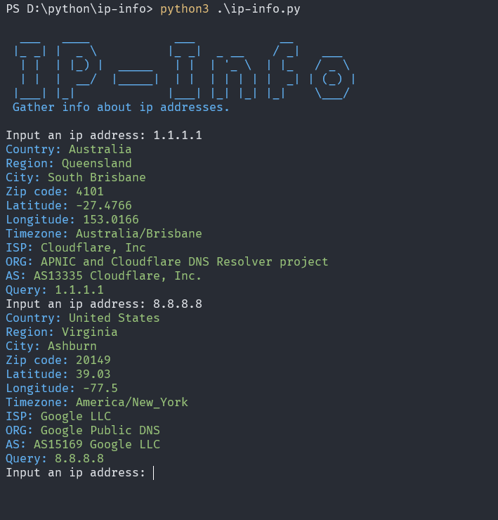

# **IP-Info**



## **Use**
Git clone repository
```bash
git clone https://github.com/hectorwithc/ip-info.git
```
Cd into the cloned directory
```bash
cd ./ip-info
```
Install required python modules
```bash
pip3 install -r ./requirements.txt
```
Start the tool: 
```bash
python3 ./ip-info.py
```

## **Requirements**
- **Python3** or later...
- **Pip3** or later...
